# Basepoint: Architecting a Data-Driven Meritocracy for Kenyan Baseball

> **"Basepoint democratizes siloed sports performance data to build a transparent, merit-based talent pipeline, turning hidden Kenyan baseball potential into visible, scout-ready global prospects."**

---

## 🏗 System Architecture: The "Democratization Funnel"

As a System Architect, I designed Basepoint to solve the **Visibility Gap** in African sports. The project follows a **Modular Monolithic** structure (v1.0.0), optimized for iteration velocity while maintaining clear internal boundaries for a future "lift-and-shift" migration to **Cloud-Native Kubernetes (v2.0.0)**.

### The Meritocracy Data Pipeline

The architecture is designed as a pipeline that converts high-entropy, subjective local game records into high-fidelity, standardized scouting outputs.

```mermaid
graph TD
    A[Raw Game Records - 163 Column CSV] -->|Ingestion| B(Go/R Pipeline)
    B -->|Normalization| C{Janitor/R 4.5.2}
    C -->|Objective Standard| D[Neon PostgreSQL Cloud]
    D -->|Analytical Modeling| E[FIP / Player Archetypes]
    E -->|Visibility| F[Verified Scout Dashboard]
    
    style F fill:#333,stroke:#333,stroke-width:4px

```



---

## 🛠 Tech Stack & Tools

* **Language:** R version 4.5.2 (Modeling & Analytical Engineering)
* **Backend:** Go (High-concurrency data ingestion)
* **Database:** Neon PostgreSQL (Serverless, Cloud-Native, with Branching)
* **IDE:** Positron (Next-gen Data Science IDE)
* **Dependency Management:** `renv` (Ensuring 100% environment reproducibility)

---

## 📂 Project Topology

The project adheres to the **Data Science Lifecycle** (Import → Tidy → Transform → Model) as defined by R for Data Science (2e) by Hadley Wickham et al.

```text
basepoint-analytics/
├── .env                # Environment variables (DB Credentials - GitIgnored)
├── .gitignore          # Ensuring security of secrets
├── renv.lock           # Dependency lockfile for R 4.5.2
├── renv/               # Isolated project library
├── R/                  # Modular Logic
│   ├── db_connect.R    # Secure DB handshake & environment injection
│   ├── modeling.R      # Analytical engine (FIP & Archetypes)
├── _targets.R          # Declarative pipeline management
└── data/               # Local staging for raw CSVs (Thika Rangers 2024)

```

---

## 🚀 Getting Started (Reproducibility)

This project is built for **Reproducibility**. To spin up the analytics engine:

### 1. Environment Setup

Create a `.env` file in the root directory. This abstracts the configuration from the logic, a critical production standard.

```ini
NEON_HOST=your-neon-host-url
NEON_DB=neondb
NEON_USER=your-user
NEON_PASS=your-password
NEON_PORT=5432

```

### 2. Restore Dependencies

Open the project in **Positron** or RStudio. The `renv` system will detect the `renv.lock` file. Run:

```r
renv::restore()

```

### 3. Run the Pipeline

We use the `targets` package to maintain a declarative pipeline. This ensures that only changed components are re-run, optimizing compute resources on the Neon cloud.

```r
targets::tar_make()

```

---

## 💎 Strategic Infrastructure: Why Neon?

Choosing **Neon PostgreSQL** provides architectural advantages that traditional RDS cannot:

* **Database Branching:** Allows for isolated testing of new analytical models without impacting the "Source of Truth."
* **Serverless Scaling:** Compute scales to zero during the off-season, optimizing operational expenditure.
* **SSL-Encryption:** Every handshake between our R/Go services and the cloud is fully encrypted, meeting international data standards.

---

## 📊 The "Source of Truth" Schema

| Entity | Role | Key Metrics |
| --- | --- | --- |
| **Players** | Dimension | Master Identity & Bio |
| **Raw Stats** | Staging | 163 GameChanger Fields |
| **Batting/Pitching** | Fact | Cleaned, Standardized Performance |
| **Insights** | Analytical | Derived FIP, Archetype Tags, Power Ratings |

---

## 🗺 Roadmap

* **v1.0.0:** (Current) Stable Monolith, Neon Cloud Integration, CSV-to-Cloud Ingestion.
* **v1.1.0:** API Implementation in Go, Real-time Leaderboards.
* **v2.0.0:** Breaking architectural shift to **Kubernetes Microservices** for continent-wide scaling.

---

## ⚖️ **License**

This project is licensed under the **MIT License**. 

---

