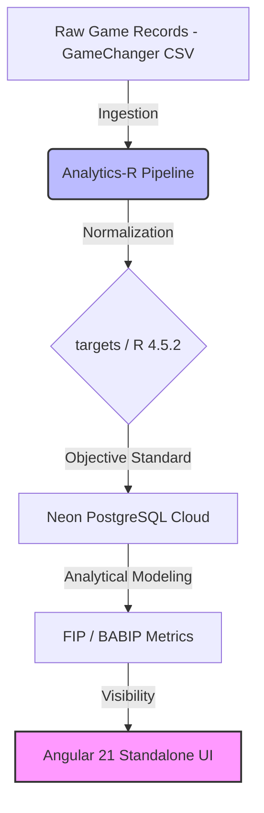

# Basepoint: Architecting a Data-Driven Meritocracy for Kenyan Baseball

> **"Basepoint democratizes siloed sports performance data to build a transparent, merit-based talent pipeline, turning hidden Kenyan baseball potential into visible, scout-ready global prospects."**

---

## 🏗 System Architecture: The "Democratization Funnel"

As a System Architect, I designed Basepoint to solve the **Visibility Gap** in African sports. The project follows a **Polyglot Monorepo** structure, optimized for iteration velocity while maintaining clear internal boundaries for a future "lift-and-shift" migration to **Cloud-Native Kubernetes**.

### The Meritocracy Data Pipeline

The architecture converts high-entropy, subjective local game records into high-fidelity, standardized scouting outputs.



---

## 📂 Project Topology (Monorepo)

The project is organized into functional domains to separate statistical modeling from data delivery.

```text
basepoint/
├── analytics-r/         # The Statistical Engine (Positron/R)
│   ├── _targets.R       # Declarative pipeline management
│   ├── R/               # Modular Logic (sabermetrics.R, db_utils.R)
│   └── data/            # Local staging for raw CSVs (Thika Rangers 2024)
├── api-go/              # (In Development) High-concurrency Ingestion Layer
├── dashboard-ui/        # (In Development) Angular 21 Signals-based UI
├── .github/workflows/   # CI/CD Pipeline validation
└── README.md            # System Documentation
```

---

## 🛠 Sabermetric Engine & Logic

Basepoint moves beyond "counting stats" to identify true talent through advanced modeling:

* **FIP (Fielding Independent Pitching):** Removes "luck" by focusing on events a pitcher controls (K, BB, HR).
    $$FIP = \frac{(13 \times HR) + (3 \times (BB + HBP)) - (2 \times K)}{IP} + C$$
* **Innings Normalization:** A custom algorithm converts non-standard amateur notation (e.g., "1.1" or "1.2") into true mathematical decimals ($1.33$ / $1.66$) to ensure denominator integrity in all rate stats.

---

## 🚀 Engineering Challenges: The "Atomic Comparison" Bug

During the development of the **Sync** phase, the pipeline encountered a critical failure:
`comparison (<) is possible only for atomic and list types`

* **The Problem:** An assignment typo (`<` vs `<-`) caused R to attempt a mathematical comparison between a live **PostgreSQL S4 Connection Object** and the pipeline metadata. 
* **The Resolution:** Corrected the assignment operator and re-architected `push_to_neon()` to be a "Side-Effect" function that returns an atomic string (timestamp) rather than a complex object, ensuring compatibility with the `{targets}` dependency graph.

---

## 🚀 Getting Started

### 1. Environment Setup
Create a `.env` file in `analytics-r/`. 
```ini
NEON_HOST=your-neon-host-url
NEON_DB=neondb
NEON_USER=your-user
NEON_PASS=your-password
```

### 2. Run the Analytics Engine
Navigate to the analytics directory and execute the pipeline:
```r
setwd("analytics-r")
targets::tar_make()
```

### 3. Verify the Graph
Visualize the data dependency and confirm all nodes (Ingest → Process → Model → Sync) are successful:
```r
targets::tar_visnetwork()
```

---

## 💎 Strategic Infrastructure: Why Neon?

Choosing **Neon PostgreSQL** provides architectural advantages for the Nairobi Baseball Community:

* **Database Branching:** Isolated testing of new Sabermetric models without impacting the "Source of Truth."
* **Serverless Scaling:** Compute scales to zero during the off-season, optimizing operational expenditure.
* **SSL-Encryption:** Mandatory encrypted handshakes ensure 100% data security for player performance records.

---

## 🗺 Roadmap

* **v0.1.x (Current):** Stable R Pipeline, Neon Cloud Integration, Verified FIP/BABIP Modeling.
* **v0.2.0:** API Implementation in **Go**, High-concurrency Ingestion.
* **v0.3.0:** Real-time Leaderboards via **Angular 21 Signals**.
* **v1.0.0:** Production Launch 

---

## ⚖️ **License**
This project is licensed under the **MIT License**.

**Developed by Keith Karani | Diamond Digest Labs**

---

